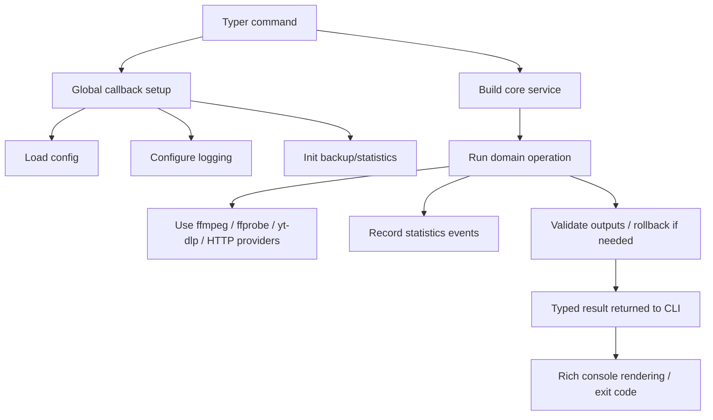

# Media Tool Architecture

## System Overview

`media-tool` is a modular Typer-based CLI for **safe, batch-oriented media processing**. The codebase combines local file transformations, metadata enrichment, download orchestration, and library hygiene checks for video, audio, subtitles, ebooks, and Jellyfin-managed libraries.

The architecture deliberately separates:

- **command handling** in `src/cli`
- **domain orchestration** in `src/core`
- **tooling and infrastructure wrappers** in `src/utils`
- **cross-cutting safety and telemetry** in `src/backup` and `src/statistics`

This separation keeps the entrypoints thin while concentrating operational logic in reusable services and typed result models.

---

## Layer Model

| Layer | Location | Primary responsibility | What it should not do |
|---|---|---|---|
| CLI | `src/cli` | Parse arguments, assemble services, render output | Contain media-processing logic |
| Core domain | `src/core` | Implement workflows, orchestration, heuristics, result models | Talk directly to terminal UI |
| Utilities | `src/utils` | Wrap external tools, config, logging, common helpers | Encode domain policy |
| Cross-cutting | `src/backup`, `src/statistics` | Safety, rollback, telemetry | Own user interaction |

### CLI layer

The root entrypoint is `src/cli/main.py`. It mounts all subcommands and performs process-level setup:

1. `setup_logging(...)`
2. `get_config()`
3. optional backup initialization via `src.backup.init()`
4. optional statistics session lifecycle via `StatsManager`, `statistics.init(...)`, and `atexit`

This means most command handlers act as adapters from **CLI flags → typed core calls**.

### Core domain layer

The core layer is split by problem domain:

- `video`, `audio`, `audiobook`
- `subtitles`, `translation`
- `metadata`, `download`, `jellyfin`
- `ebook`, `workflow`, `audit`

A typical core service:

- accepts `Path` objects and typed options
- performs precondition checks
- delegates shell-level work to utilities
- returns a structured result object instead of printing

### Utilities layer

`src/utils` contains the infrastructure adapters that make the system predictable:

- `config.py` → TOML + environment-based configuration
- `logging_config.py` → Rich console logging and rotating file logging
- `ffmpeg_runner.py`, `ffprobe_runner.py`, `ytdlp_runner.py` → subprocess wrappers
- `fuzzy_matcher.py`, `jellyfin_naming.py`, `file_operations.py` → shared helper logic

These modules are intentionally low-level and mostly stateless.

---

## Dependency Boundaries

The intended dependency direction is:

```text
CLI -> Core -> Utils
         |      
         +-> Backup / Statistics
```

### Practical boundary rules

- `src/cli/*` may import from `core`, `utils`, `src.statistics`, and `src.backup`
- `src/core/*` may import from `utils` and the cross-cutting packages
- `src/utils/*` should remain independent of CLI concerns
- `src/statistics` and `src/backup` expose services used by core flows but do not depend on Typer command handlers

Some compatibility shims exist for the `src.*` import layout. Those are runtime packaging details rather than a separate architectural layer.

---

## Runtime Control Flow

### Typical command lifecycle



### Shared result model strategy

The project uses dataclasses and enums to make operations explicit:

- `ConversionResult`, `MergeResult`, `UpscaleResult`
- `DownloadRequest`, `DownloadResult`
- `PipelineResult` for metadata enrichment
- `WorkflowContext`, `StepResult`, `WorkflowResult`
- `BackupEntry`, `ValidationResult`

This avoids “stringly typed” command outcomes and keeps failure handling testable.

---

## Design Principles

### 1. Thin CLI, rich core

Typer commands mostly translate user input into service calls. The actual behavior lives in modules like:

- `core.video.converter`
- `core.download.download_manager`
- `core.ebook.workflow.ebook_processor`
- `core.workflow.runner`

### 2. Batch safety first

Mutation-heavy operations prefer **safe defaults**:

- skip existing outputs unless `overwrite=True`
- support `dry_run` in orchestration layers
- validate post-state after transforms where feasible
- wrap destructive rewrites in backup/rollback mechanisms

### 3. Idempotent-by-default behavior

Many operations intentionally short-circuit when the desired result already exists:

- metadata generation skips existing NFO files unless overwrite is enabled
- conversion/remux steps skip existing targets
- organization layers avoid replacing targets unless explicitly requested

This matters for interrupted batch runs and repeatable NAS workflows.

### 4. Best-effort telemetry, not hard dependency

Statistics recording is intentionally non-blocking. Failures in telemetry should not break media processing. This pattern appears throughout the codebase via guarded `get_collector().record(...)` calls inside `try/except` blocks.

### 5. Explicit extension points

Provider contracts and factories isolate external variability:

- `SubtitleProvider`
- translation backends via `TranslatorProtocol`
- ebook metadata and cover providers

This makes integrations replaceable without rewriting orchestrators.

---

## Workflow Engine Architecture

The `src/core/workflow` package provides the highest-level automation skeleton.

### Execution model

- `WorkflowRunner` executes a fixed ordered list of `BaseStep` instances
- each step implements `precondition(ctx)`, `run(ctx)`, and optional `post_check(ctx, result)`
- `WorkflowContext` carries `working_files`, `metadata`, `dry_run`, and `stop_on_failure`
- `WorkflowResult` aggregates all per-step outcomes

### Default movie workflow

`build_movie_pipeline()` currently wires **six** concrete steps:

1. `s01_merge_language_dupes`
2. `s02_mp4_to_mkv`
3. `s03_upscale_dvd`
4. `s04_encode_bluray`
5. `s05_subtitles`
6. `s06_organize`

> Metadata enrichment is currently a separate module/CLI flow and is **not** part of the default workflow runner.

---

## Cross-Cutting Systems

### Backup and rollback

`BackupManager` creates a copy of the original file, persists a `BackupEntry`, validates the transformed output, and then either:

- marks the backup as validated and cleans it up, or
- rolls back on validation failure or runtime failure

This pattern is used by video conversion, merge/upscale, and ebook normalization flows.

### Statistics

`StatsCollector` captures `StatEvent` items during the process lifetime. `StatsManager` later aggregates them into a persisted `StatsSnapshot` using specialized aggregators for:

- video
- audio
- subtitles
- ebooks
- system events

The session lifecycle is started in the CLI callback and flushed at process exit.

---

## Concurrency Model

The project mixes sequential and concurrent behavior deliberately.

| Pattern | Where used | Why |
|---|---|---|
| Sequential mutation pipelines | workflow, remux, upscale, organization | safer rollback and deterministic side effects |
| Thread-pool scanning | `core.audio.library_scanner`, ffprobe caching | higher throughput for read-heavy operations |
| HTTP retry/backoff | subtitle and Jellyfin/TMDB integrations | resilience to transient remote failures |

The dominant rule is: **read-heavy tasks may parallelize; write-heavy tasks prefer determinism**.

---

## External Integration Model

| Integration | Adapter | Role |
|---|---|---|
| `ffmpeg` | `utils.ffmpeg_runner` | transforms, muxing, re-encoding |
| `ffprobe` | `utils.ffprobe_runner` | technical inspection and stream analysis |
| `yt-dlp` | `core.download.yt_dlp_runner` / `utils.ytdlp_runner` | downloads and remote media extraction |
| OpenSubtitles API | `core.subtitles.opensubtitles_provider` | subtitle search/download |
| TMDB API | `core.metadata.tmdb_provider` | movie metadata and artwork discovery |
| Jellyfin REST API | `core.jellyfin.client` | server-side library maintenance |
| Ebook sources | provider interfaces under `core.ebook.*.providers` | metadata and cover enrichment |

The wrappers normalize subprocess and HTTP behavior into predictable Python-level outcomes.

---

## Project Map

```text
src/
├── cli/            Typer commands and rich presentation
├── core/           Domain orchestration and typed models
│   ├── video/      remux, merge, upscale, inspection, trailers, whisper
│   ├── audio/      scan, tag, enhance, organize, convert
│   ├── subtitles/  provider-backed subtitle acquisition
│   ├── translation/format-preserving subtitle translation
│   ├── metadata/   TMDB lookup, title parsing, NFO/artwork generation
│   ├── ebook/      identify, enrich, normalize, organize, convert, deduplicate
│   ├── download/   yt-dlp orchestration and error normalization
│   ├── jellyfin/   server inspection and metadata repair
│   ├── audit/      quality/compliance checks over libraries
│   └── workflow/   staged automation over media folders
├── backup/         backup index, validation, rollback, quota protection
├── statistics/     event collection, aggregation, persistence
└── utils/          config, logging, subprocess wrappers, helper utilities
```

---

## Implementation-Dependent Areas

A few behaviors are intentionally heuristic or environment-sensitive and should be treated as such in extensions:

- filename parsing for title/year extraction
- provider ranking quality from TMDB / OpenSubtitles / ebook metadata sources
- hardware encoder availability on the current host
- subtitle fallback behavior when third-party services are unavailable
- exact organization quality when metadata is incomplete

When extending the system, prefer **new typed result models and new provider implementations** over embedding more logic into CLI commands.