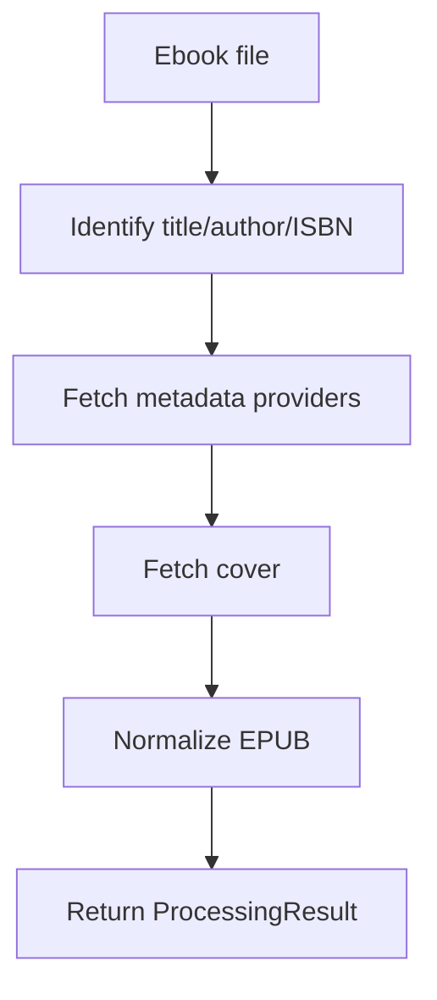

# Ebook Pipeline

## Scope

This document describes the implemented ebook processing pipeline composed by `core.ebook.workflow.ebook_processor.EbookProcessor` and the supporting normalization/organization services.

Unlike the movie workflow, the ebook pipeline is not a single numbered runner; it is a **service-composed workflow** with two primary entry modes:

- `enrich(...)` for one file
- `organize_library(...)` for library-wide placement

---

## Enrichment Flow

### Step details

1. **Identification**
   - `BookIdentifier`-style logic inspects filename, embedded metadata, and ISBN patterns.
   - Produces a `BookIdentity` with a confidence score.

2. **Metadata fetch**
   - `MetadataService.fetch_metadata()` first tries ISBN-based lookup.
   - If no ISBN result exists, it fans out to title/author searches across configured providers.
   - Candidate ranking uses fuzzy matching and completeness scoring.

3. **Cover retrieval**
   - `CoverService` asks one or more `CoverProvider` implementations for candidate covers.

4. **Normalization**
   - `EbookNormalizer.normalize()` validates the EPUB, optionally creates a backup, embeds metadata and cover, repairs/generates TOC data, and validates the result.

5. **Result assembly**
   - `ProcessingResult` captures which sub-operations actually succeeded.

---

## Library Organization Flow

When organizing a folder or library root, the processor:

1. scans for supported ebook formats (`.epub`, `.mobi`, `.azw3`, `.azw`, `.pdf`)
2. identifies each file
3. optionally enriches metadata
4. derives a target structure from `LibraryOrganizer`
5. moves or copies the file into the library root

The organizer can run in `dry_run` mode or `copy_instead_of_move` mode, which is useful for cautious migrations.

---

## Safety and Rollback

The mutation-heavy normalization phase integrates with the backup subsystem:

- backup before changing the EPUB
- validate the resulting file
- cleanup on success
- rollback on failure

This is particularly important because EPUB normalization updates archive internals and metadata content rather than producing a wholly separate output file.

---

## Performance Considerations

The ebook pipeline is mostly sequential per file. This favors:

- deterministic filesystem changes
- simpler rollback semantics
- easier diagnosis of provider/enrichment failures

Large library runs still scale reasonably because the per-file orchestration is lightweight compared with video transforms.

---

## Implementation-Dependent Areas

The final quality of organization depends on:

- how strong the initial identification was
- provider coverage for the specific book
- metadata completeness and ISBN availability
- the chosen organization/naming template

When those signals are weak, the pipeline still aims to produce a valid path, but the human quality of the result may require later review.