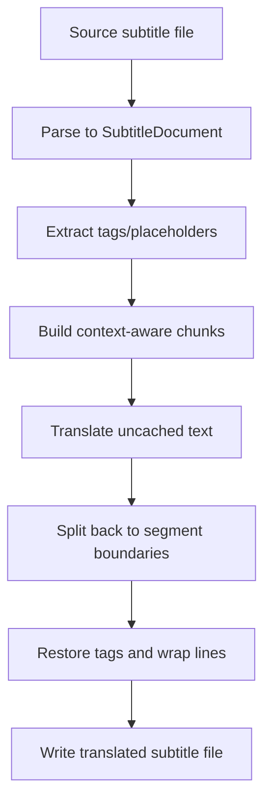

# Subtitle Pipeline

## Scope

The subtitle pipeline spans both subtitle acquisition and local translation. In practice the project supports two major paths:

1. **Acquire and embed** subtitles from a provider
2. **Translate** existing subtitle files while preserving formatting and timing

---

## Acquisition Path

### Inputs

- a media file path
- language preferences (for example `de`, `en`)
- optional hash and metadata hints
- a configured OpenSubtitles API key

### Flow

```text
probe media -> compute movie info -> search provider -> rank matches -> download subtitle -> optionally mux into MKV
```

### Main components

- `SubtitleDownloadManager`
- `OpenSubtitlesProvider`
- `FFmpegMuxer`
- `SubtitleMatch`, `MovieInfo`, `DownloadResult`

### Selection behavior

The provider attempts to choose better results using a combination of:

- release-name similarity
- provider rating
- download count
- preference against hearing-impaired subtitles unless necessary

---

## Translation Path

### Inputs

- subtitle file (`.srt`, `.ass`, `.vtt`, etc.)
- source/target language pair
- translation backend (`opus-mt` or `argos`)
- optional overwrite/dry-run behavior

### Flow



### Important implementation details

- translation is performed on a **format-independent intermediate model**
- chunking is designed to preserve sentence context rather than translating one segment at a time
- if translation returns a mismatched line count, the system falls back to proportional redistribution
- optional auto language detection uses `langdetect` when available

---

## Failure Handling

### Acquisition failures

Typical causes include:

- no OpenSubtitles API key
- no matching subtitles found
- rate limiting or HTTP errors from the provider
- mux failures during MKV embedding

These are surfaced as operational outcomes rather than crashing the whole application.

### Translation failures

Typical causes include:

- missing backend dependencies
- unsupported or bitmap subtitle formats
- write errors for the output file
- malformed source subtitle content

`TranslationResult` reports `SUCCESS`, `FAILED`, or `SKIPPED` explicitly.

---

## Relationship to Workflow

The workflow step `s05_subtitles.py` currently uses the acquisition side of this pipeline for movie automation. The translation side is also available through dedicated subtitle commands and can be run independently of the movie pipeline.

This separation keeps remote provider concerns and local translation concerns loosely coupled while still allowing them to be composed when needed.